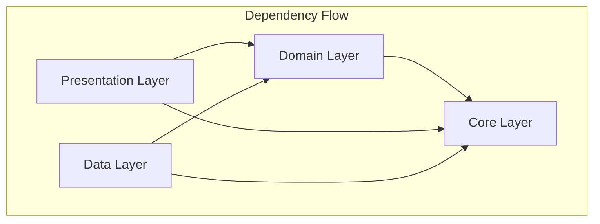
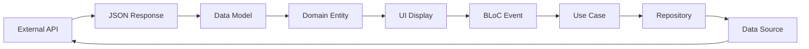
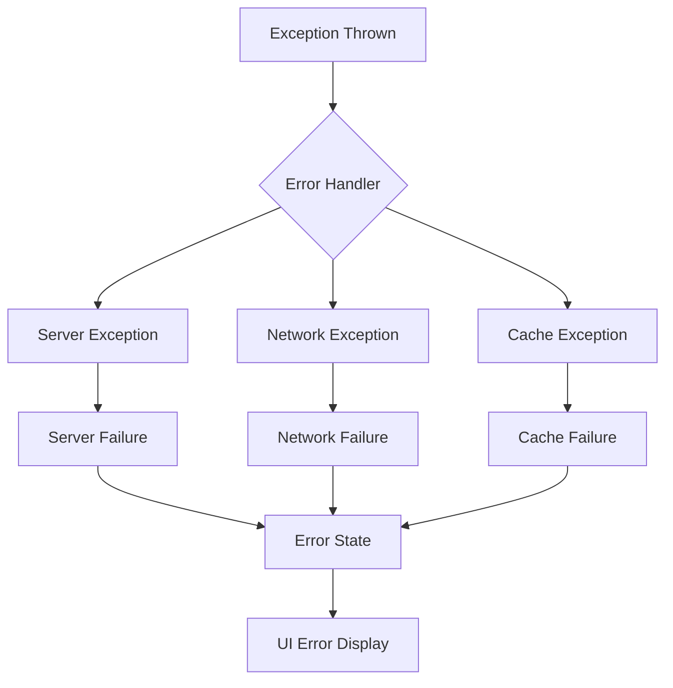
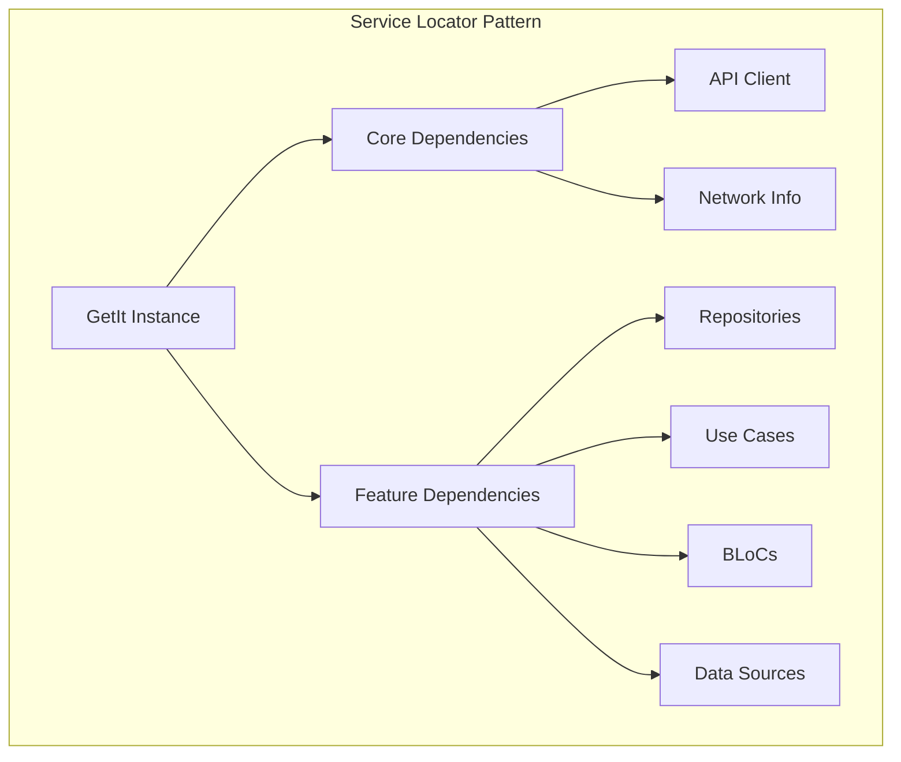
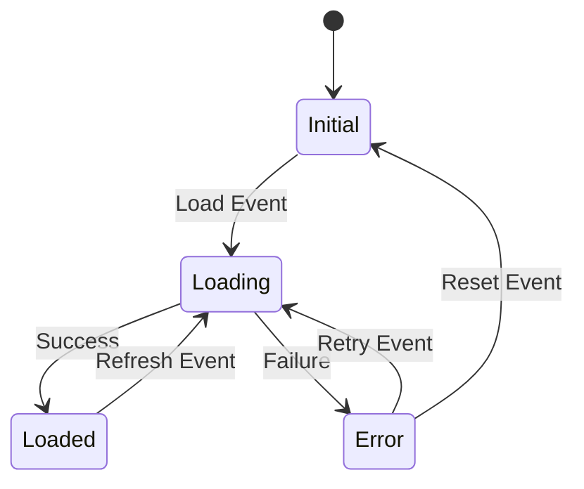
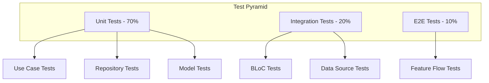

# 🏗️ Architecture Documentation

## Clean Architecture Implementation

This document provides detailed technical information about the clean architecture implementation in the Anime App.

## Layer Dependencies



## Feature Architecture Template

Each feature follows the same architectural pattern:

### Domain Layer Structure
```
domain/
├── entities/           # Business objects (no dependencies)
├── repositories/       # Abstract contracts
└── usecases/          # Business logic operations
```

### Data Layer Structure
```
data/
├── models/            # Data transfer objects
├── datasources/       # External data access
└── repositories/      # Repository implementations
```

### Presentation Layer Structure
```
presentation/
├── bloc/              # State management
│   ├── [feature]_bloc.dart
│   ├── [feature]_event.dart
│   └── [feature]_state.dart
├── views/             # UI screens
└── widgets/           # Reusable components
```

## Data Transformation Flow



## Error Handling Strategy



## Dependency Injection Pattern



## State Management Flow



## Testing Strategy



## Performance Considerations

### Lazy Loading Strategy
- Dependencies are registered lazily with GetIt
- BLoCs are created only when needed
- API calls are cached appropriately

### Memory Management
- BLoCs are disposed automatically
- Image caching with proper cleanup
- Efficient list rendering with ListView.builder

### Network Optimization
- Request debouncing for search
- Proper error handling and retry logic
- Connection timeout management

## Security Considerations

### API Security
- No sensitive data in repository
- Proper error message handling
- Network security with HTTPS

### Data Privacy
- Local storage encryption (when implemented)
- No personal data collection
- Secure API key management

## Scalability Features

### Modular Architecture
- Feature-based module separation
- Independent feature development
- Easy feature addition/removal

### Code Reusability
- Shared core components
- Generic use case patterns
- Reusable UI widgets

### Maintainability
- Clear separation of concerns
- Consistent naming conventions
- Comprehensive documentation

This architecture ensures the app is scalable, maintainable, and follows industry best practices.
