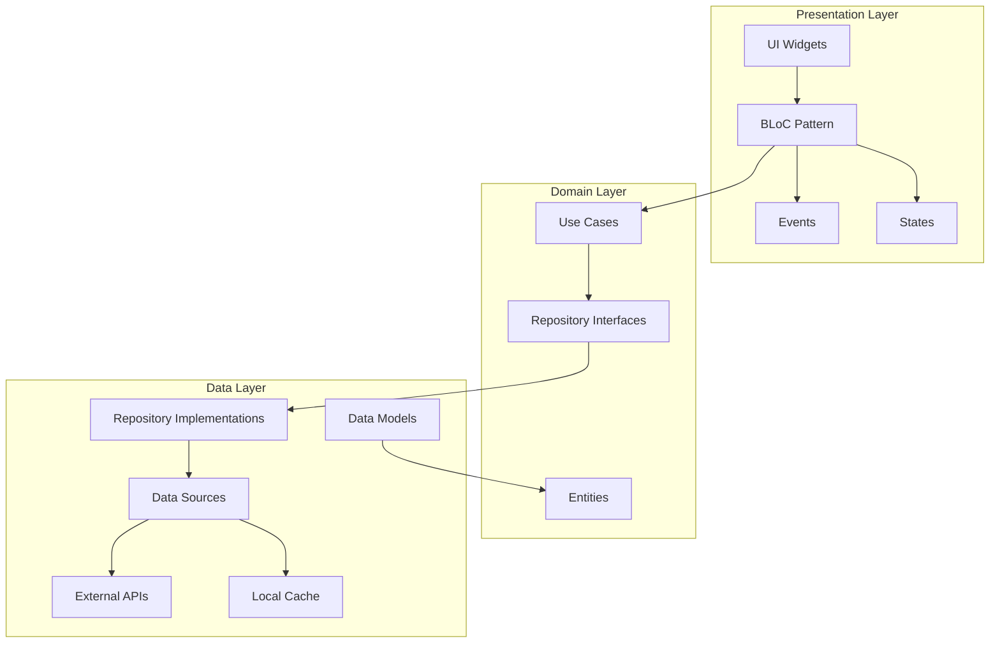
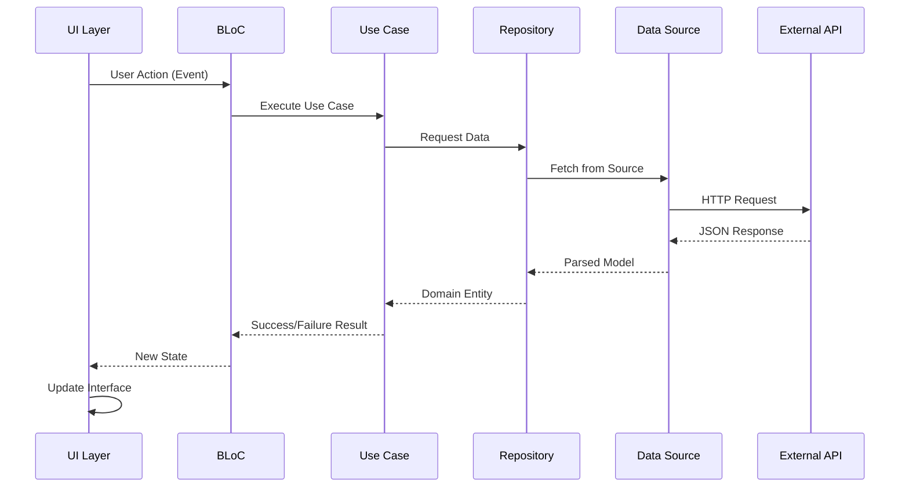
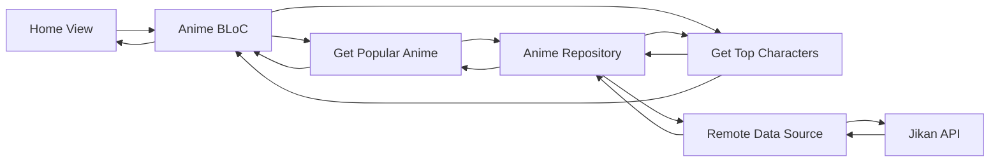
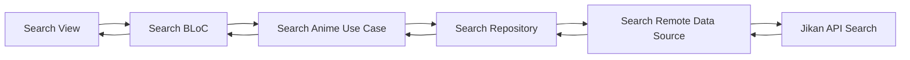
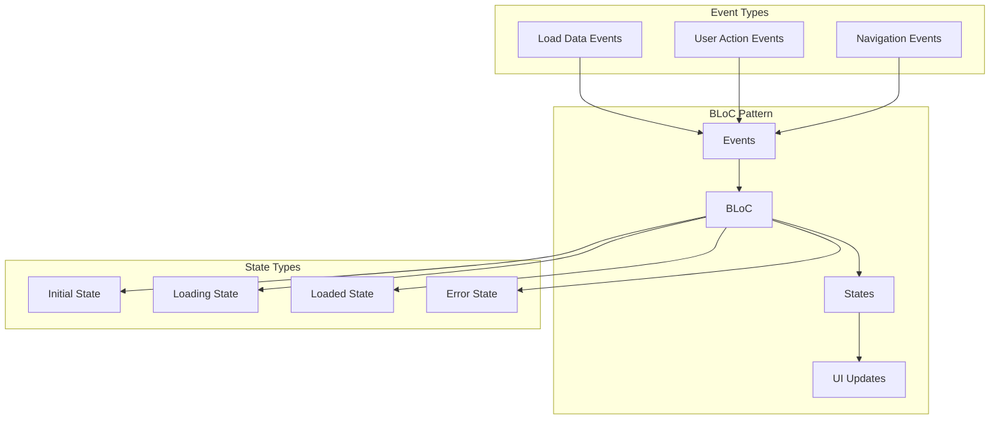
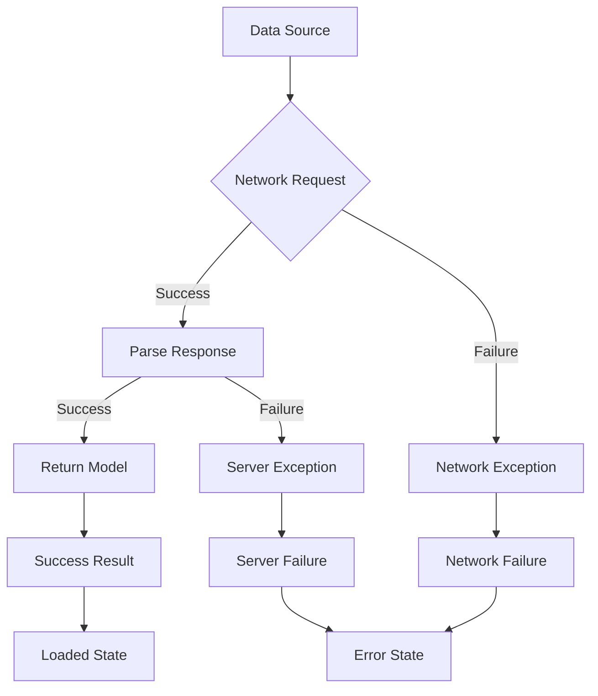

# 🎌 Anime App - Flutter Clean Architecture

A modern Flutter application for anime enthusiasts, built with Clean Architecture principles and featuring a comprehensive anime database, search functionality, and personalized user experience.

## 📱 Features

- **🏠 Home**: Browse popular anime and top characters
- **🔍 Search**: Find anime by title, genre, or keywords
- **🌟 Explore**: Discover anime by genres and categories
- **📱 Details**: View detailed anime information and statistics
- **🌐 Language**: Multi-language support with localization
- **⚙️ Settings**: Customize app preferences and configurations
- **💳 Subscriptions**: Premium subscription plans and features

## 🏗️ Architecture Overview

This application follows **Clean Architecture** principles with a clear separation of concerns across three main layers:



## 🗂️ Project Structure

```
lib/
├── core/                           # Core functionality
│   ├── errors/                     # Error handling
│   │   ├── failures.dart          # Abstract failure classes
│   │   └── exceptions.dart        # Exception definitions
│   ├── network/                   # Network layer
│   │   ├── api_client.dart        # HTTP client setup
│   │   └── network_info.dart      # Network connectivity
│   ├── usecase/                   # Base use case
│   │   └── usecase.dart           # Use case interface
│   └── di/                        # Dependency Injection
│       └── injection_container.dart # GetIt service locator
│
├── features/                      # Feature modules
│   ├── home/                      # Home feature
│   │   ├── domain/
│   │   │   ├── entities/          # Business entities
│   │   │   ├── repositories/      # Repository contracts
│   │   │   └── usecases/          # Business logic
│   │   ├── data/
│   │   │   ├── models/            # Data models
│   │   │   ├── datasources/       # Data source implementations
│   │   │   └── repositories/      # Repository implementations
│   │   └── presentation/
│   │       ├── bloc/              # State management
│   │       ├── views/             # UI screens
│   │       └── widgets/           # Reusable UI components
│   │
│   ├── search/                    # Search functionality
│   ├── explore/                   # Genre-based exploration
│   ├── details/                   # Anime details
│   ├── language/                  # Localization
│   ├── settings/                  # App configuration
│   └── subscriptions/             # Premium features
│
└── main.dart                      # App entry point
```

## 🔄 Data Flow Architecture

### Overall Data Flow



### Feature-Specific Data Flows

#### 🏠 Home Feature Flow



#### 🔍 Search Feature Flow



## 🎯 Clean Architecture Layers

### 1. **Presentation Layer** 📱
- **Responsibility**: UI components and state management
- **Components**:
  - Flutter Widgets (Views)
  - BLoC Pattern (Business Logic Components)
  - Events and States
- **Dependencies**: Domain Layer only

### 2. **Domain Layer** 🧠
- **Responsibility**: Business logic and rules
- **Components**:
  - Entities (Business objects)
  - Use Cases (Business operations)
  - Repository Interfaces (Data contracts)
- **Dependencies**: No dependencies on other layers

### 3. **Data Layer** 💾
- **Responsibility**: Data management and external communication
- **Components**:
  - Models (Data representations)
  - Data Sources (API, Local storage)
  - Repository Implementations
- **Dependencies**: Domain Layer only

## 🔧 Dependencies & State Management

### Key Dependencies

```yaml
dependencies:
  # Core Flutter
  flutter:
    sdk: flutter
  
  # State Management
  flutter_bloc: ^9.1.1
  equatable: ^2.0.7
  
  # Dependency Injection
  get_it: ^8.2.0
  
  # Network & API
  dio: ^5.9.0
  dartz: ^0.10.1
  
  # UI & Responsive Design
  flutter_screenutil: ^5.9.3
  flutter_svg: ^2.2.1
  google_fonts: ^6.3.1
  google_nav_bar: ^5.0.7
  
  # Local Storage
  hive: ^2.2.3
  hive_flutter: ^1.1.0
```

### State Management Pattern



## 🌐 API Integration

### Jikan API Integration

The app integrates with the [Jikan API](https://jikan.moe/) for anime data:

```mermaid
graph LR
    subgraph "API Endpoints"
        A[/anime - Search Anime]
        B[/top/anime - Popular Anime]
        C[/top/characters - Top Characters]
        D[/anime/{id} - Anime Details]
        E[/genres/anime - Genre List]
    end
    
    subgraph "App Features"
        F[Search Feature]
        G[Home Feature]
        H[Details Feature]
        I[Explore Feature]
    end
    
    A --> F
    B --> G
    C --> G
    D --> H
    E --> I
```

## 🔄 Error Handling

### Error Flow Architecture



### Error Types

- **ServerFailure**: API server errors
- **NetworkFailure**: Connectivity issues
- **CacheFailure**: Local storage errors
- **ValidationFailure**: Input validation errors

## 🚀 Getting Started

### Prerequisites

- Flutter SDK (^3.9.0)
- Dart SDK
- Android Studio / VS Code
- Android SDK / iOS SDK

### Installation

1. **Clone the repository**
   ```bash
   git clone <repository-url>
   cd anime_app
   ```

2. **Install dependencies**
   ```bash
   flutter pub get
   ```

3. **Run the app**
   ```bash
   flutter run
   ```

### Build Commands

```bash
# Debug build
flutter run

# Release build (Android)
flutter build apk --release

# Release build (iOS)
flutter build ios --release
```

## 🔮 Future Enhancements

- [ ] Offline caching with Hive
- [ ] Push notifications
- [ ] User authentication
- [ ] Favorites and watchlist
- [ ] Social features and reviews
- [ ] Dark mode theme
- [ ] Advanced filtering options
- [ ] Video streaming integration

## 🤝 Contributing

1. Fork the repository
2. Create a feature branch (`git checkout -b feature/amazing-feature`)
3. Commit your changes (`git commit -m 'Add some amazing feature'`)
4. Push to the branch (`git push origin feature/amazing-feature`)
5. Open a Pull Request

## 📄 License

This project is licensed under the MIT License - see the [LICENSE](LICENSE) file for details.

## 🙏 Acknowledgments

- [Jikan API](https://jikan.moe/) for providing comprehensive anime data
- [Flutter](https://flutter.dev/) team for the amazing framework
- [BLoC Library](https://bloclibrary.dev/) for state management
- Open source community for the incredible packages

---

**Built with ❤️ using Flutter and Clean Architecture**